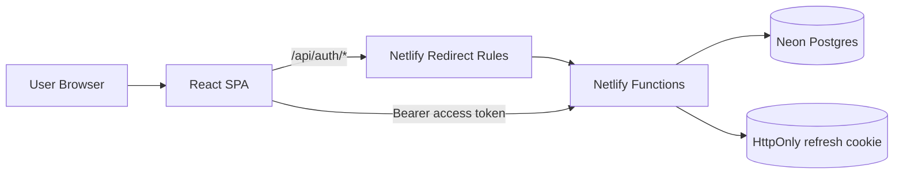
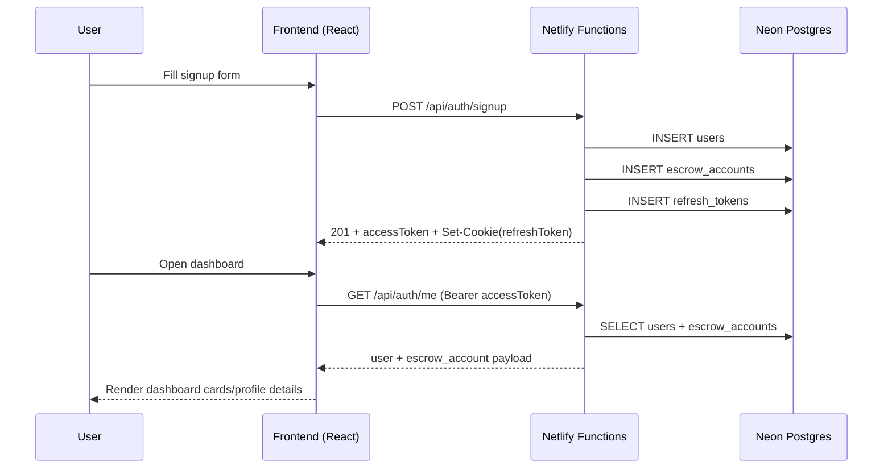

# ISEA Unified Auth Platform (Netlify + Neon)

ISEA is a unified serverless authentication and onboarding platform deployed as a single Netlify project.

It includes:
- React frontend (`frontend/`)
- Netlify Functions backend (`netlify/functions/`)
- Neon Postgres via Netlify DB extension

## 5-Minute Quickstart

```bash
# from repo root
npx netlify-cli login
npx netlify-cli link
npx netlify-cli db init
npx netlify-cli env:set DATABASE_URL "$(npx netlify-cli env:get NETLIFY_DATABASE_URL)"
psql "$(npx netlify-cli env:get NETLIFY_DATABASE_URL_UNPOOLED)" -f backend/src/db/schema.sql
npx netlify-cli env:set JWT_SECRET "<random-secret-1>"
npx netlify-cli env:set JWT_REFRESH_SECRET "<random-secret-2>"
npx netlify-cli env:set FRONTEND_URL "https://<your-site>.netlify.app"
npx netlify-cli deploy --prod
```

Generate secrets with:

```bash
openssl rand -base64 48
openssl rand -base64 48
```

## What This Repository Provides

- Signup and signin flows
- JWT access tokens + HTTP-only refresh cookie
- User profile data persistence
- Escrow account creation at signup
- Dashboard data endpoint (`/api/auth/me`)
- Audit logging

## System Architecture



## Auth + Dashboard Workflow



## Repository Structure

```text
isea-entry/
├── frontend/                        # React SPA
│   ├── src/components/              # SignupForm, SigninForm
│   ├── src/pages/                   # AuthPage, DashboardPage
│   ├── src/services/apiClient.ts    # API client + fallback routing
│   └── src/stores/authStore.ts      # Zustand auth state
├── netlify/functions/               # Serverless backend functions
│   ├── auth-signup.js
│   ├── auth-signin.js
│   ├── auth-refresh-token.js
│   ├── auth-me.js
│   ├── auth-logout.js
│   └── auth-utils.js
├── backend/src/db/schema.sql        # PostgreSQL schema
└── netlify.toml                     # Unified build/functions/redirect config
```

## From-Scratch Setup Guide

### 1) Prerequisites

Install:
- Node.js 18+
- npm
- Netlify CLI (via `npx netlify-cli` or global install)
- Postgres client (`psql`)

On macOS (`psql`):

```bash
brew install libpq
brew link --force libpq
```

If `psql` still is not found:

```bash
echo 'export PATH="/usr/local/opt/libpq/bin:$PATH"' >> ~/.zshrc
source ~/.zshrc
```

### 2) Clone and install dependencies

```bash
git clone <your-repo-url>
cd isea-entry
npm install
npm --prefix frontend install
```

### 3) Login and link to Netlify site

```bash
npx netlify-cli login
npx netlify-cli link
```

If site does not exist yet:
- choose `Create & configure a new project`
- keep note of generated site URL (example: `https://theone-entry1.netlify.app`)

### 4) Initialize Netlify DB (Neon)

```bash
npx netlify-cli db init
```

When prompted:
- `Set up Drizzle boilerplate?` -> `No`

Confirm DB variables exist:

```bash
npx netlify-cli env:list
```

Expected keys:
- `NETLIFY_DATABASE_URL`
- `NETLIFY_DATABASE_URL_UNPOOLED`

### 5) Map runtime DB variable expected by app code

The functions read `DATABASE_URL`, so map it:

```bash
npx netlify-cli env:set DATABASE_URL "$(npx netlify-cli env:get NETLIFY_DATABASE_URL)"
```

### 6) Apply database schema

Use unpooled URL for migration/DDL:

```bash
psql "$(npx netlify-cli env:get NETLIFY_DATABASE_URL_UNPOOLED)" -f backend/src/db/schema.sql
```

Successful run should show `CREATE TABLE` and `CREATE INDEX` outputs.

### 7) Set required auth and frontend environment variables

Generate two random secrets:

```bash
openssl rand -base64 48
openssl rand -base64 48
```

Set env vars:

```bash
npx netlify-cli env:set JWT_SECRET "<first-random-value>"
npx netlify-cli env:set JWT_REFRESH_SECRET "<second-random-value>"
npx netlify-cli env:set FRONTEND_URL "https://<your-site>.netlify.app"
```

### 8) Verify env vars are present

```bash
npx netlify-cli env:list
```

Ensure these exist:
- `DATABASE_URL`
- `JWT_SECRET`
- `JWT_REFRESH_SECRET`
- `FRONTEND_URL`
- `NETLIFY_DATABASE_URL`
- `NETLIFY_DATABASE_URL_UNPOOLED`

### 9) Deploy unified app (frontend + functions)

```bash
npx netlify-cli deploy --prod
```

This single command deploys:
- frontend static build from `frontend/build`
- serverless functions from `netlify/functions`

### 10) Smoke-test production

Replace with your URL:

```bash
curl -i -X POST https://<your-site>.netlify.app/api/auth/signup \
  -H "Content-Type: application/json" \
  -d '{
    "email":"test@example.com",
    "first_name":"Test",
    "last_name":"User",
    "password":"TestPass123!"
  }'
```

Expected:
- `201` on successful signup
- JSON body includes `accessToken`

## API Endpoints

| Method | Route | Function | Description |
|---|---|---|---|
| POST | `/api/auth/signup` | `auth-signup` | Register user + escrow account |
| POST | `/api/auth/signin` | `auth-signin` | Authenticate user |
| POST | `/api/auth/refresh-token` | `auth-refresh-token` | Refresh access token |
| GET | `/api/auth/me` | `auth-me` | Fetch current dashboard profile |
| POST | `/api/auth/logout` | `auth-logout` | End current session |

## Environment Variables Reference

Runtime-critical:
- `DATABASE_URL`: pooled DB URL used by functions
- `JWT_SECRET`: access token signing secret
- `JWT_REFRESH_SECRET`: refresh token signing secret
- `FRONTEND_URL`: allowed frontend origin for CORS headers

Netlify DB generated:
- `NETLIFY_DATABASE_URL`: pooled endpoint for runtime
- `NETLIFY_DATABASE_URL_UNPOOLED`: direct endpoint for migrations

### Pooled vs Unpooled

- Use pooled URL for application runtime (`DATABASE_URL`)
- Use unpooled URL for schema migrations and direct SQL (`psql`)

## Local Development Notes

Frontend local run:

```bash
npm --prefix frontend start
```

Backend local Express service exists in `backend/`, but production path is Netlify Functions.

## Common Issues and Fixes

### `Request failed (403)` on signup/signin

Check:
- `netlify.toml` has auth redirects before catch-all redirect
- Deploy includes latest `frontend/src/services/apiClient.ts`
- Site access protection is not blocking requests

### `Request failed (502)` on auth routes

Usually missing env vars.

Verify:

```bash
npx netlify-cli env:list
```

Ensure required values exist, then redeploy.

### Schema fails with `type "idx_*" does not exist`

You are likely using old MySQL-style schema syntax. This repository already contains corrected PostgreSQL schema. Re-run migration using latest `backend/src/db/schema.sql`.

### Dashboard only shows partial user data

Ensure latest functions are deployed:
- `netlify/functions/auth-signup.js`
- `netlify/functions/auth-me.js`

Older users may have null values for fields not previously captured.

## Security Checklist

After any exposed output/log:
- Rotate DB credentials if a DB URL/password was exposed
- Regenerate `JWT_SECRET` and `JWT_REFRESH_SECRET`
- Update env vars in Netlify
- Redeploy

If you make the repository public, treat all previously printed secrets as compromised.

## Additional Docs

- [NETLIFY_README.md](./NETLIFY_README.md)
- [DOCUMENTATION.md](./DOCUMENTATION.md)
- [DEPLOYMENT.md](./DEPLOYMENT.md)
