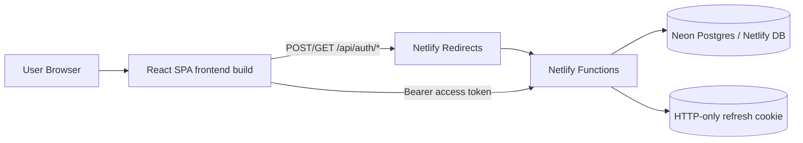
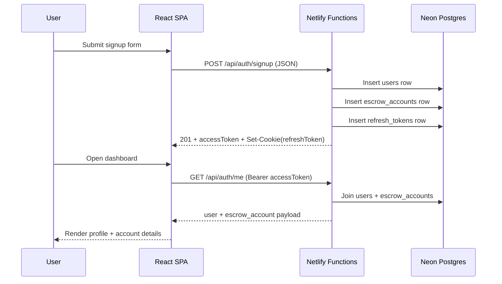

# ISEA Unified Auth Platform (Netlify + Neon)

ISEA is a unified serverless authentication and account onboarding app deployed on Netlify.

The project includes:
- React frontend (`frontend/`)
- Netlify Functions backend (`netlify/functions/`)
- Neon Postgres (via Netlify DB extension)

Everything is deployed as one Netlify site.

## Current Capabilities

- User signup and signin
- JWT access token auth with refresh-token cookie
- User profile fields persisted to Postgres
- Escrow account record creation during signup
- Dashboard profile data fetch (`/api/auth/me`)
- Audit log entries for auth events

## Architecture



## Auth Workflow



## Repository Structure

```text
isea-entry/
├── frontend/                   # React app
│   ├── src/components/         # Signup/signin forms
│   ├── src/pages/              # Auth + Dashboard pages
│   ├── src/services/           # API client
│   └── src/stores/             # Zustand auth store
├── netlify/functions/          # Serverless auth functions
│   ├── auth-signup.js
│   ├── auth-signin.js
│   ├── auth-refresh-token.js
│   ├── auth-me.js
│   ├── auth-logout.js
│   └── auth-utils.js
├── backend/src/db/schema.sql   # PostgreSQL schema used by functions
└── netlify.toml                # Unified deploy config
```

## API Endpoints

| Method | Route | Function | Purpose |
|---|---|---|---|
| POST | `/api/auth/signup` | `auth-signup` | Create user + escrow account |
| POST | `/api/auth/signin` | `auth-signin` | Authenticate user |
| POST | `/api/auth/refresh-token` | `auth-refresh-token` | Rotate access token |
| GET | `/api/auth/me` | `auth-me` | Fetch dashboard user/account data |
| POST | `/api/auth/logout` | `auth-logout` | Clear session |

## Environment Variables (Netlify)

Required for runtime:

- `DATABASE_URL` (set to pooled DB URL)
- `JWT_SECRET`
- `JWT_REFRESH_SECRET`
- `FRONTEND_URL` (for this site: `https://theone-entry1.netlify.app`)

Provided by Netlify DB extension:

- `NETLIFY_DATABASE_URL` (pooled)
- `NETLIFY_DATABASE_URL_UNPOOLED` (direct, good for migrations)

Recommended mapping:

```bash
npx netlify-cli env:set DATABASE_URL "$(npx netlify-cli env:get NETLIFY_DATABASE_URL)"
```

## Local Setup

1. Install dependencies

```bash
npm install
npm --prefix frontend install
```

2. Ensure `psql` is installed and apply schema

```bash
psql "<your_db_url>" -f backend/src/db/schema.sql
```

3. Run frontend locally

```bash
npm --prefix frontend start
```

## Netlify Deploy (Unified)

Deploy from repo root:

```bash
npx netlify-cli deploy --prod
```

This deploy includes:
- Static frontend from `frontend/build`
- Functions from `netlify/functions`

## Data Model Overview

Core tables:
- `users`
- `escrow_accounts`
- `refresh_tokens`
- `audit_logs`
- `profile_pictures`

Dashboard currently reads from:
- `users` profile columns
- `escrow_accounts` onboarding/account columns

## Known Limitations

- Signup currently sends JSON only; profile image binary upload is not yet wired into Netlify functions.
- Existing users created before recent field mapping fixes may have null values for newer dashboard fields.

## Quick Troubleshooting

- `403` on signup/signin:
  - Check redirect rules in `netlify.toml`
  - Confirm `/api/auth/*` routes resolve to functions

- `502` on auth endpoints:
  - Usually missing env vars (`DATABASE_URL`, JWT secrets)

- Missing dashboard fields:
  - Confirm latest deployment includes updated `auth-me.js` and `auth-signup.js`
  - Confirm DB rows contain those fields

## Supporting Docs

- [NETLIFY_README.md](./NETLIFY_README.md)
- [DOCUMENTATION.md](./DOCUMENTATION.md)
- [DEPLOYMENT.md](./DEPLOYMENT.md)
